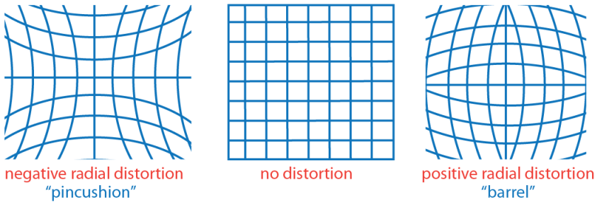
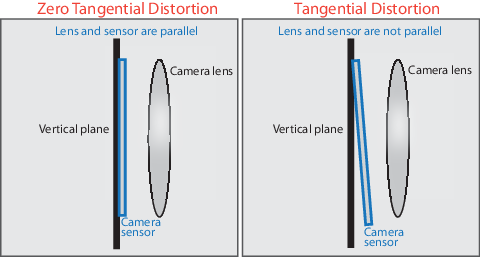

# Radial Tangential Distortion

Lens distortion generally exist in all camera lenses, therefore it is vital we
model the distortions observed. The most common distortion model is the
radial-tangential (or simply as radtan) distortion model. The two main
distortion components, as the name suggests, are the radial and tangential
distortion.

Radial distortion occurs due to the shape of the lens, where light passing
through the center undergoes no refraction, and light passing through the edges
of the lens, undergoes through severe bending causing the radial distortion.

Tangential distortion, on the other hand, is mainly due to camera sensor
misalignment during the manufacturing process. It occurs when the camera sensor
is not in parallel with the lens.

The combined radial-tangential distortion is modelled using a polynomial
approximation with parameters $k_{1}, k_{2}$ and $p_{1}, p_{2}$ respectively.
To apply the distortion the observed 3D point $\Vec{p} = [x \enspace y \enspace
z]^{\transpose}$ is first projected, distorted, and finally scaled and offset
in the image plane $(u, v)$.

\begin{align}
  \begin{split}
    x &= X / Z \\
    y &= Y / Z \\
    r^2 &= x^2 + y^2 \\ \\
    x' &= x \cdot (1 + (k_1 r^2) + (k_2 r^4)) \\
    y' &= y \cdot (1 + (k_1 r^2) + (k_2 r^4)) \\
    x'' &= x' + (2 p_1 x y + p_2 (r^2 + 2 x^2)) \\
    y'' &= y' + (p_1 (r^2 + 2 y^2) + 2 p_2 x y)
  \end{split}
\end{align}

## Radial Tangential Point Jacobian

\begin{align}
  \begin{split}
    \dfrac{\partial{\Vec{d}_{\text{radtan}}}}{\partial{\Vec{p}_{C}}} &=
      \begin{bmatrix}
        J_{11} & J_{12} \\
        J_{21} & J_{22}
      \end{bmatrix} \\ \\
      r^2 &= x^2 + y^2 \\ \\
      J_{11} &= k_1 r^2 + k_2 r^4 + 2 p_1 y + 6 p_2 x
        + x (2 k_1 x + 4 k_2 x r^2) + 1 \\
      J_{12} &= 2 x p_1 + 2 y p_2 + y (2 k_1 x + 4 k_2 x r^2) \\
      J_{21} &= 2 x p_1 + 2 y p_2 + y (2 k_1 x + 4 k_2 x r^2) \\
      J_{22} &= k_1 r^2 + k_2 r^4 + 6 p_1 y + 2 p_2 x
        + y (2 k_1 y + 4 k_2 y r^2) + 1
    \end{split}
\end{align}

## Radial Tangential Parameter Jacobian

\begin{align}
  \begin{split}
    \dfrac{\partial{\Vec{d}_{\text{radtan}}}}{\partial{\Vec{d}_{\text{params}}}} &=
      \begin{bmatrix}
        J_{11} & J_{12} & J_{13} & J_{14} \\
        J_{21} & J_{22} & J_{23} & J_{24}
      \end{bmatrix} \\ \\
      r^2 &= x^2 + y^2 \\ \\
      J_{11} &= x r^2 \\
      J_{12} &= x r^4 \\
      J_{13} &= 2 x y \\
      J_{14} &= 3 x^2 + y^2 \\ \\
      J_{21} &= y r^2 \\
      J_{22} &= y r^4 \\
      J_{23} &= x^2 + 3 y^2 \\
      J_{24} &= 2 x y
    \end{split}
\end{align}
