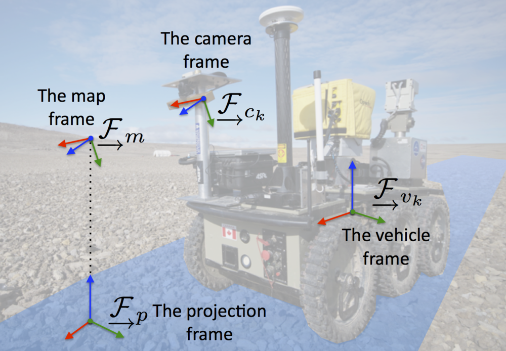
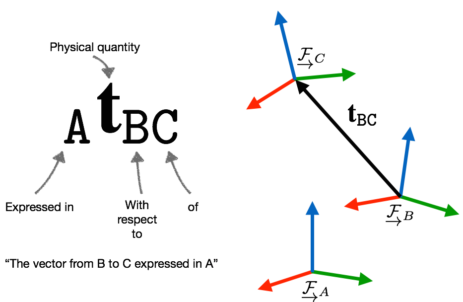
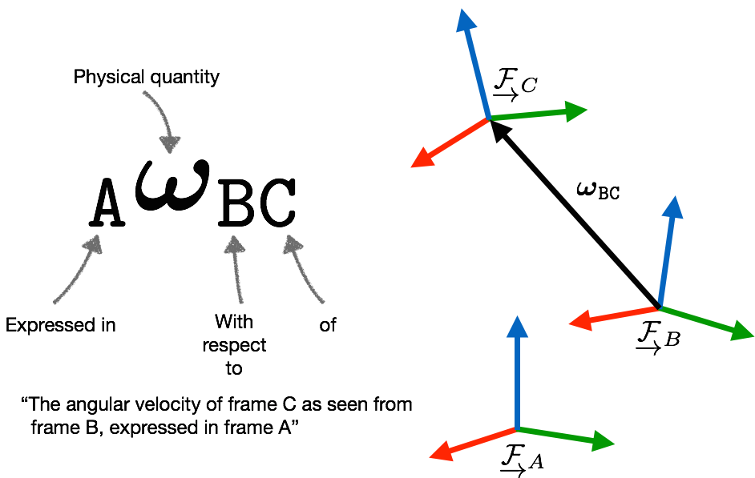
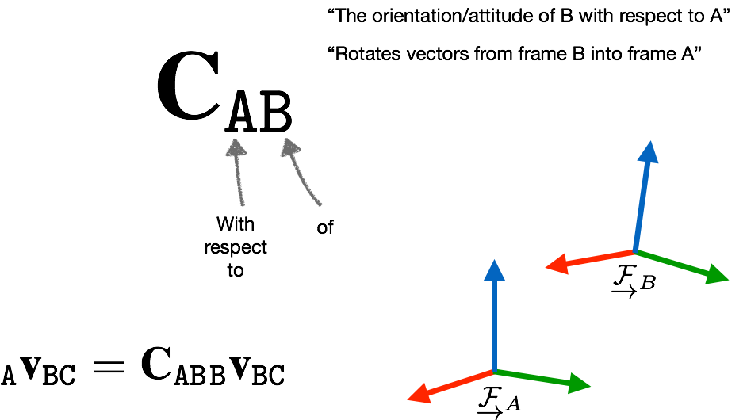

# Notations

A large part of robotics is about developing machines that perceives and
interact with the environment. For that robots use sensors to collect and
process data, and knowing what the data describes is of utmost importance.
Imagine obtaining the position of the robot but not knowing what that position
is with respect to. Missing data descriptions such as what a position vector is
expressing, what is it with respect to and more causes many hours of painful
trail and error to extract that information.

The notes will be closly following the frame notation as described by Paul
Furgale. The aim is to mitigate the ambiguity that arises when describing
robot poses, sensor data and more.

A vector expressed in the world frame, $\frame_{W}$, is written as $\pos_{W}$.
Or more precisely if the vector describes the position of the camera frame,
$\frame_{C}$, expressed in $\frame_{W}$, the vector can be written as
$\pos_{WC}$. The left hand subscripts indicates the coordinate system the
vector is expressed in, while the right-hand subscripts indicate the start and
end points. For brevity if the vector has the same start point as the frame to
which it is expressed in, the same vector can be written as $\pos_{WC}$.
Similarly a transformation of a point from $\frame_{W}$ to $\frame_{C}$ can be
represented by a homogeneous transform matrix, $\tf_{WC}$, where its rotation
matrix component is written as $\rot_{WC}$ and the translation component
written as $\trans_{WC}$. A rotation matrix that is parametrized by quaternion
$\quat_{WC}$ is written as $\rot\{\quat_{WC}\}$.

\begin{align}
  &\text{Position:} \enspace & \pos_{WB} \\
  &\text{Velocity:} \enspace & \vel_{WB} \\
  &\text{Acceleration:} \enspace & \acc_{WB} \\
  &\text{Angular velocity:} \enspace & \angvel_{WB} \\
  &\text{Rotation:} \enspace & \rot_{WB} \\
  &\text{Transform:} \enspace & \tf_{WB} \\
\end{align}

